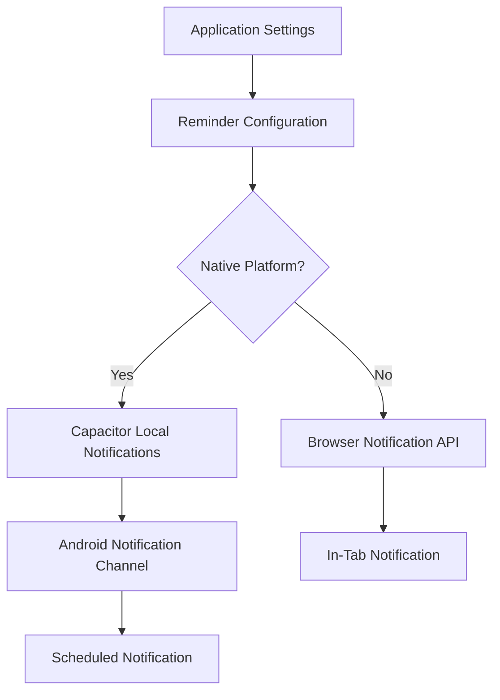
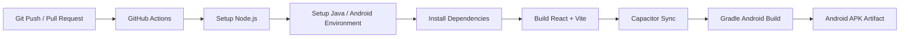
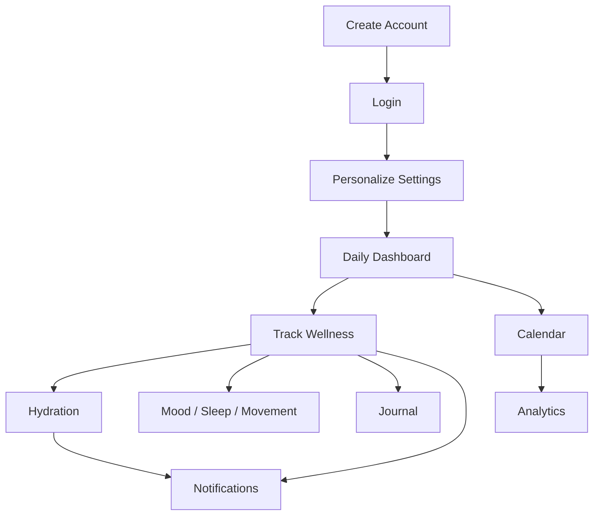

# Wellness Tracker

> A full-stack personal wellness and habit tracking platform featuring daily check-ins, cycle analytics, personalized insights, adaptive reminders, and native Android support.


[](https://github.com/monikajothi/Personal-Tracker/actions)

---

## 📌 Overview

**Wellness Tracker** is a full-stack personal wellness platform designed to help users build healthier routines and understand their wellbeing over time.

The application combines daily wellness tracking, habit management, hydration monitoring, journaling, cycle tracking, analytics, reminders, and personalized UI features into a single responsive experience.

The project is built around a **React + Vite frontend**, **Node.js + Express REST API**, and **MongoDB persistence layer**, with **Capacitor** used to package the web application as a native Android application.

The same application can therefore be delivered across:

- 🌐 Web
- 📱 Android
- ⚙️ Automated CI/CD environments

---

## 🔗 Live Demo & Deployment

### 🌐 Web Application

**Live Demo:**  
https://personal-tracker-two-pi.vercel.app/

### 📱 Android Application

The React application is packaged into a native Android application using **Capacitor**.

### ⚙️ CI/CD

Android builds are automated through GitHub Actions:

https://github.com/monikajothi/Personal-Tracker/actions

---

# ✨ Key Features

## 📊 Daily Wellness & Habit Tracking

Track multiple aspects of everyday wellbeing from a single dashboard.

- Daily wellness check-ins
- Sleep tracking
- Hydration tracking
- Mood tracking
- Movement/activity tracking
- Food and nutrition tracking
- Self-care tracking
- Learning tracking
- Custom habit creation
- Daily completion progress
- Historical wellness records

---

## 💧 Adaptive Hydration Tracking

The hydration system provides configurable water goals and intelligent reminder scheduling.

### Features

- Custom daily hydration target
- Configurable glass size
- Water intake tracking
- Progress toward daily hydration goals
- Adaptive reminder intervals
- Configurable minimum and maximum reminder intervals
- Custom repeat intervals
- Reminder start and end windows
- Quiet hours
- Quick hydration logging
- Native notification actions
- Browser notification fallback

The native implementation uses Capacitor Local Notifications and dynamically schedules reminders based on the user's remaining hydration target and configured reminder window.

---

## 🩸 Menstrual Cycle Tracking & Analytics

For users who enable cycle tracking, the application provides dedicated cycle-related monitoring and analytics.

### Features

- Period day tracking
- Flow tracking
- Cycle history
- Cycle duration analysis
- Cycle prediction
- Historical cycle trends
- Relationship between cycle data and wellbeing metrics
- Cycle-aware calendar information

---

## 📅 Calendar & Historical Tracking

The calendar provides a historical view of wellness activity.

- Browse previous days
- View daily completion status
- Open detailed day information
- Review historical wellness entries
- Access category-specific information
- Track progress over time
- Cycle-aware calendar information

---

## 📈 Analytics & Insights

The application transforms logged wellness data into useful summaries.

### Analytics include

- Weekly wellness summaries
- Habit completion trends
- Historical progress
- Cycle duration trends
- Cycle predictions
- Habit/mood correlations
- Category-level completion information

This provides users with a higher-level view instead of requiring them to manually interpret individual daily entries.

---

## 📝 Personal Journal - Jar of Stars

The journal provides a dedicated space for reflective daily entries alongside a visual "Jar of Stars" mood and gratitude tracker.

### Key Capabilities

* **Daily Reflection Logs:** Record entries capturing daily experiences, gratitude, accomplishments, emotional states, challenges, and future goals.
* **Jar of Stars Integration:** Every journal entry or gratitude reflection adds a visual "star" to an interactive Jar of Stars container, providing an immediate visual representation of consistent wellness tracking.
* **Integrated History:** Journal entries are synced directly with the user's daily check-in logs, allowing historical review through the dynamic calendar view.

---

## 🔔 Reminders & Notifications

The application supports both browser-based and native notification workflows.

### Daily Check-In Reminders

Users can configure daily reminders encouraging them to complete their wellness tracking.

### Hydration Reminders

Hydration reminders are dynamically scheduled according to:

- Current water intake
- Daily hydration target
- Glass size
- Reminder window
- Minimum interval
- Maximum interval
- Repeat interval
- Quiet hours

### Native Android Notifications

When running as the Android application, notifications use:

- Capacitor Local Notifications
- Android notification channels
- Scheduled notifications
- Notification actions
- Background-compatible scheduling
- Quick hydration actions

### Browser Fallback

When running in a browser, the application falls back to the Web Notification API where supported.

---

## 🎨 Personalization

The application provides configurable UI and wellness preferences.

### Customization includes

- Multiple visual themes
- Light/dark visual modes
- Animation preferences
- Companion selection
- Custom habits
- Reminder settings
- Hydration settings
- Wellness category preferences

---

## 🐾 Interactive Companion

A lightweight companion system provides contextual interaction within the application.

The companion can respond to:

- Daily progress
- Completion status
- User-selected companion preferences
- Wellness tracking activity

The system uses reusable React components and configurable companion states rather than being hard-coded into individual pages.

---

# 🛠️ Technology Stack

| Layer | Technologies |
| :--- | :--- |
| **Frontend** | React, JavaScript ES6+, Vite |
| **UI** | CSS3, Responsive React Components |
| **Backend** | Node.js, Express.js |
| **Database** | MongoDB, Mongoose |
| **Authentication** | JSON Web Tokens (JWT), bcryptjs |
| **API** | RESTful HTTP / JSON APIs |
| **Mobile** | Capacitor, Android |
| **Notifications** | Capacitor Local Notifications, Web Notifications API |
| **CI/CD** | GitHub Actions |
| **Web Deployment** | Vercel |
| **Version Control** | Git, GitHub |

---

# 🏗️ System Architecture

The application follows a layered architecture separating the client, API, authentication, persistence, and mobile delivery layers.

```mermaid
flowchart TD

    U[User]

    subgraph Client["Client Layer"]
        A[React + Vite Web Application]
        B[Reusable Components]
        C[Custom React Hooks]
        D[Client State & Local Persistence]
    end

    subgraph Mobile["Mobile Layer"]
        E[Capacitor]
        F[Android Application]
        G[Native Local Notifications]
    end

    subgraph Server["Backend Layer"]
        H[Node.js]
        I[Express.js REST API]
        J[JWT Authentication Middleware]
    end

    subgraph Data["Persistence Layer"]
        K[Mongoose ODM]
        L[(MongoDB)]
    end

    U --> A

    A --> B
    A --> C
    C --> D

    A <-->|HTTP / JSON| I

    A --> E
    E --> F
    F --> G

    I --> J
    J --> K
    K --> L
````

---

# 🔄 Application Data Flow

A typical wellness entry follows this flow:

```mermaid
sequenceDiagram

    participant User
    participant React as React Frontend
    participant API as Express REST API
    participant Auth as JWT Middleware
    participant DB as MongoDB

    User->>React: Update wellness entry
    React->>API: Send authenticated request
    API->>Auth: Validate JWT
    Auth-->>API: Request authorized
    API->>DB: Create / update entry
    DB-->>API: Persisted data
    API-->>React: Updated response
    React-->>User: Refresh UI state
```

---

# 📱 Web-to-Android Architecture

The application uses Capacitor to transform the React web application into a native Android application.

```text
React + Vite
     │
     │ Production Build
     ▼
Web Assets
     │
     │ Capacitor Sync
     ▼
Capacitor Android Project
     │
     │ Gradle Build
     ▼
Android APK
     │
     ▼
Mobile Application
```

This architecture allows the project to share the same frontend codebase between the web application and Android application while still accessing native Android capabilities such as local notifications.

---

# 🔌 REST API

The backend exposes RESTful endpoints for authentication, wellness data, settings, and analytics.

## Authentication

| Method | Endpoint           | Purpose                       |
| :----- | :----------------- | :---------------------------- |
| `POST` | `/api/auth/signup` | Create a new user account     |
| `POST` | `/api/auth/login`  | Authenticate an existing user |

---

## Wellness Entries

| Method | Endpoint                     | Purpose                               |
| :----- | :--------------------------- | :------------------------------------ |
| `GET`  | `/api/entries`               | Retrieve wellness entries             |
| `GET`  | `/api/entries/:date`         | Retrieve an entry for a specific date |
| `GET`  | `/api/entries/:date/history` | Retrieve historical entries           |
| `PUT`  | `/api/entries/:date`         | Create or update a wellness entry     |

Date values use the format:

```text
YYYY-MM-DD
```

---

## Settings & Personalization

| Method | Endpoint        | Purpose                |
| :----- | :-------------- | :--------------------- |
| `GET`  | `/api/settings` | Retrieve user settings |
| `PUT`  | `/api/settings` | Update user settings   |

Settings include user-specific preferences such as themes, companions, habits, reminders, and wellness configuration.

---

## Analytics

| Method | Endpoint                          | Purpose                           |
| :----- | :-------------------------------- | :-------------------------------- |
| `GET`  | `/api/analytics/cycle-prediction` | Calculate cycle prediction        |
| `GET`  | `/api/analytics/cycle-history`    | Retrieve cycle duration history   |
| `GET`  | `/api/analytics/correlation`      | Calculate habit/mood correlations |
| `GET`  | `/api/analytics/weekly-summary`   | Retrieve weekly wellness summary  |

---

# 📁 Project Structure

The repository is organized into separate frontend, backend, mobile, and automation layers.

```text
Personal-Tracker/
│
├── Frontend/
│   ├── src/
│   │   ├── components/
│   │   ├── pages/
│   │   ├── hooks/
│   │   ├── utils/
│   │   ├── theme/
│   │   ├── constants.js
│   │   └── App.jsx
│   │
│   ├── public/
│   ├── package.json
│   ├── vite.config.*
│   └── capacitor.config.*
│
├── moni-tracker-backend/
│   ├── routes/
│   ├── models/
│   ├── middleware/
│   ├── controllers/
│   ├── server.*
│   └── package.json
│
├── android/
│   └── Native Android / Capacitor project
│
├── .github/
│   └── workflows/
│       └── android-build.yml
│
└── README.md
```

> Directory names may vary slightly depending on the repository revision. The important architectural separation is between the React client, backend API, Android wrapper, and CI/CD workflow.

---

# ⚛️ Frontend Architecture

The frontend is built using a modular React architecture.

Key implementation patterns include:

### Reusable Components

Common UI elements are implemented as reusable React components rather than duplicated across pages.

### Custom Hooks

Application logic is separated into reusable hooks for areas such as:

* Authentication
* Wellness entries
* User settings
* Daily reminders
* Hydration reminders

### Lazy Loading

Major application pages are lazy-loaded using React's `lazy()` and `Suspense` APIs.

This reduces the initial JavaScript required before the user accesses individual sections of the application.

### Derived State

Dashboard progress, completion percentages, hydration values, and other UI-level metrics are derived from persisted wellness data rather than duplicated as independent state.

### Responsive UI

The application is designed to work across browser and mobile layouts, with the same React application being packaged into Android using Capacitor.

---

# 🔐 Authentication & Security

The application implements token-based authentication using JWT.

### Authentication Flow

```text
User
 │
 ├── Signup
 │      ↓
 │   Backend
 │      ↓
 │   Password Hashing
 │      ↓
 │   User Record
 │
 └── Login
        ↓
     Backend
        ↓
     JWT Token
        ↓
   Client Session
```

### Security-related implementation

* JWT-based authentication
* Password hashing using `bcryptjs`
* Protected API requests
* Server-side environment variables
* Database credentials isolated from source code
* Client-side authentication state persistence

### Token Persistence

The current implementation maintains authentication state using browser `localStorage`.

This allows the application to restore the user's authenticated state when the application is reopened.

---

# 💾 Data Persistence

MongoDB provides persistent storage for user and wellness information.

Mongoose is used as the ODM layer between the Express API and MongoDB.

The persistence layer supports data such as:

* User accounts
* Wellness entries
* Habit information
* User settings
* Hydration configuration
* Reminder configuration
* Cycle-related information
* Journal data

User-specific data is associated with the authenticated account so that application data can be retrieved and updated through authenticated API requests.

---

# 🔔 Notification Architecture

The notification system supports separate native and browser execution paths.



The native implementation supports notification actions such as:

* `+1 glass`
* `+2 glasses`
* `Snooze`

These actions allow hydration activity to be recorded directly from the notification workflow.

---

# 💧 Adaptive Hydration Scheduling

Hydration reminders are not simply fixed notifications.

The scheduling logic considers:

```text
Daily Target
     │
     ▼
Current Intake
     │
     ▼
Remaining Water
     │
     ▼
Remaining Time
     │
     ▼
Required Reminder Frequency
     │
     ├── Minimum Interval
     ├── Maximum Interval
     ├── Reminder Window
     └── Quiet Hours
     │
     ▼
Next Hydration Reminder
```

This allows reminder frequency to adapt as the user's remaining hydration requirement changes throughout the day.

---

# 🚀 CI/CD Pipeline

The project uses **GitHub Actions** to automate Android build workflows.

The workflow is defined under:

```text
.github/workflows/android-build.yml
```

The automated pipeline is responsible for the Android build process, including the required environment setup, frontend build, Capacitor synchronization, and Android compilation.



### CI/CD Benefits

* Repeatable Android builds
* Automated environment setup
* Consistent frontend compilation
* Automated Capacitor synchronization
* Automated Gradle compilation
* Reduced manual APK build steps
* Build status visibility through GitHub Actions

---

# 🛠️ Local Development Setup

## Prerequisites

Install the following before starting development:

* Node.js 18+
* npm 9+
* MongoDB or MongoDB Atlas
* Java/JDK for Android development
* Android Studio for local APK development
* Android SDK
* Capacitor dependencies

---

## 1. Clone the Repository

```bash
git clone https://github.com/monikajothi/Personal-Tracker.git
cd Personal-Tracker
```

---

# 🖥️ Backend Setup

Navigate to the backend:

```bash
cd moni-tracker-backend
```

Install dependencies:

```bash
npm install
```

Create the environment file:

```bash
cp .env.example .env
```

Configure the required environment variables:

```env
PORT=4000
MONGO_URI=mongodb://localhost:27017/moni-tracker
JWT_SECRET=your_jwt_secret_key_here
```

Start the backend development server:

```bash
npm run dev
```

The backend will run on:

```text
http://localhost:4000
```

---

# 🌐 Frontend Setup

Open a new terminal and navigate to the frontend:

```bash
cd Frontend
```

Install dependencies:

```bash
npm install
```

Start the Vite development server:

```bash
npm run dev
```

The application will normally be available at:

```text
http://localhost:5173
```

---

# 📱 Android Development

The project uses Capacitor to package the React application as a native Android application.

## Build the Web Application

```bash
cd Frontend
npm run build
```

## Synchronize Capacitor

```bash
npx cap sync android
```

## Open Android Studio

```bash
npx cap open android
```

From Android Studio, the Android project can be compiled and deployed to an emulator or physical Android device.

---

# 📦 Building the Android APK

The local Android build process follows:

```text
React Source
     ↓
npm run build
     ↓
Production Web Bundle
     ↓
npx cap sync android
     ↓
Android Project
     ↓
Gradle Build
     ↓
APK
```

The generated APK can then be installed on a compatible Android device for testing.

---

# 🌍 Deployment

## Web

The frontend is deployed through **Vercel**.

Production deployment follows the standard Vite production build process.

```bash
npm run build
```

---

## Android

Android builds are generated through the Capacitor Android project and can also be automated through GitHub Actions.

---

# 🔧 Environment Variables

Environment variables are used to keep deployment configuration and sensitive credentials outside the source code.

Typical backend configuration includes:

```env
PORT=4000
MONGO_URI=<mongodb-connection-string>
JWT_SECRET=<jwt-secret>
```

> Never commit production secrets, database credentials, or private keys to GitHub.

---

# 🧠 Engineering Highlights

## Modular React Architecture

The application separates pages, reusable components, hooks, utilities, themes, and application-level state.

This improves maintainability and allows individual features to evolve independently.

---

## Full-Stack REST Architecture

The system separates frontend presentation from backend business/data operations.

```text
React UI
   │
   │ REST / JSON
   ▼
Express API
   │
   │ Mongoose
   ▼
MongoDB
```

---

## Cross-Platform Application Delivery

The same React frontend powers both:

* Web application
* Native Android application

Capacitor provides the bridge between the web application and native mobile functionality.

---

## Native + Browser Feature Fallback

Notification functionality adapts based on the runtime environment:

```text
             Application
                  │
          ┌───────┴───────┐
          │               │
       Browser          Android
          │               │
 Web Notifications   Capacitor APIs
```

This allows the project to maintain a shared application architecture while supporting platform-specific capabilities.

---

## Adaptive Reminder Scheduling

Hydration notifications use the user's current progress and configured constraints to calculate appropriate reminder timing instead of relying solely on static intervals.

---

## Lazy-Loaded Application Pages

Major application pages are loaded on demand, reducing the initial frontend loading cost and keeping the application shell lightweight.

---

## Persistent User Configuration

User preferences such as themes, companion selection, habits, reminders, and hydration settings are persisted and restored between sessions.

---

# ⚡ Performance Considerations

The application incorporates several implementation patterns intended to keep the user experience responsive:

* Lazy-loaded React pages
* Reusable component architecture
* Custom hooks for isolated application logic
* Derived progress calculations
* Client-side state persistence
* Targeted historical data retrieval
* Native notification scheduling rather than relying entirely on active browser sessions
* Separation between UI and backend persistence

---

# 🧪 Testing & Validation

The project can be validated across multiple execution environments:

### Web

```bash
npm run dev
```

### Production Build

```bash
npm run build
```

### Android

```bash
npx cap sync android
npx cap open android
```

### CI/CD

Android builds can be validated through the GitHub Actions workflow.

---

# 📋 Example User Flow



---

# 🔮 Future Improvements

Potential future enhancements include:

* Expanded analytics and visualization
* More advanced wellness insights
* Enhanced offline-first capabilities
* Expanded automated testing
* Additional native mobile integrations
* Improved synchronization for multi-device usage
* More granular notification controls

These are potential improvements and are not represented as currently implemented functionality.

---

# 🤝 Contributing

Contributions and improvements are welcome.

### Development Workflow

1. Fork the repository.
2. Create a feature branch.

```bash
git checkout -b feature/your-feature
```

3. Make your changes.
4. Test the application locally.
5. Commit your changes.

```bash
git commit -m "feat: add your feature"
```

6. Push the branch.

```bash
git push origin feature/your-feature
```

7. Open a Pull Request.

---

# 🔒 Security

If you discover a security issue, avoid publicly exposing sensitive information such as:

* JWT secrets
* Database credentials
* API keys
* Private environment variables
* User data

Instead, report the issue privately to the repository maintainer.

---

# 📄 License

If a license is present in the repository, refer to the repository's license file for the applicable terms.

---

# 👩‍💻 Author

**Monika Jothi**

GitHub:
https://github.com/monikajothi

---

<p align="center">

### Wellness Tracker

**Track your day. Understand your patterns. Build healthier routines.**

</p>

